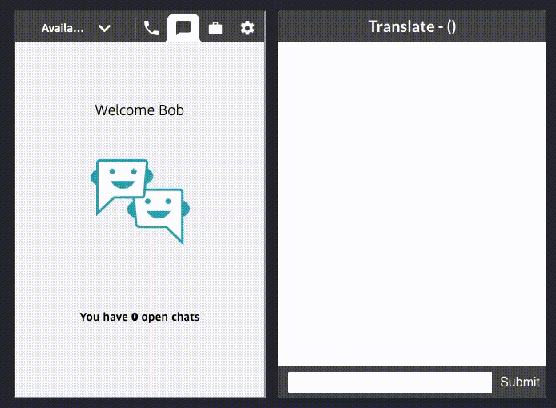
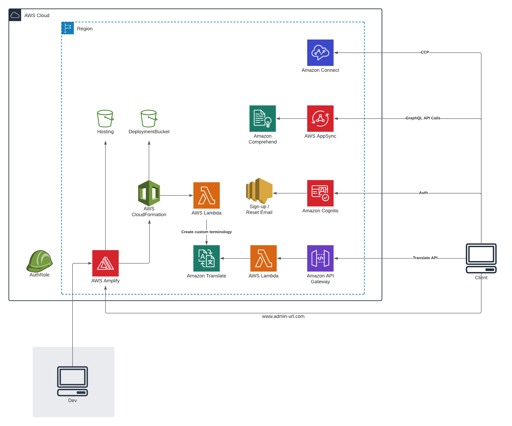
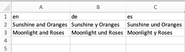

# Translate CCP Demo for Amazon Connect

**NOTE: This is a fork of [VoiceFoundry's GitHub repository](https://github.com/voicefoundry-cloud-public/Amazon-Connect-Chat-Translate-Demo) that addresses deployment issues reported by users and provides ability to address any future user concerns.** 

This is a sample project that demonstrates using Amazon Translate with Amazon Connect chat to perform real-time translation on chat messages, allowing a user to support dozens of languages. The web app supports multi-chat allow an Amazon Connect Chat user to support multiple languages concurrently. Deployment is using the Amplify UI (No CLI access required) and is using serverless architecture. Deployment takes about 10 minutes. 

Read the Amazon blog: https://www.amazon.com/livechattranslate 

### Demo

### Architecture

### Pre-Reqs

- Existing Amazon Connect Instance ([Create an instance in 3 easy steps](https://docs.aws.amazon.com/connect/latest/adminguide/tutorial1-set-up-your-instance.html))
- Github account ([Create a free GitHub account](https://github.com/join))

### Deploy

- Fork this repository in your Github account  
- Navigate to [Amplify Console](https://console.aws.amazon.com/amplify/)
- Get Started with Amplify Hosting
- Connect to Github
- Select repository - `amazon-connect-chat-translate`
- Click on 'Create new role' then `Next: Permissions` > `Next: Tags` > `Next: Review` finally `Create role`
- Click `Create new environment` for backend
- Expand `Environment variables` and add the following:
  - `REACT_APP_CONNECT_REGION` = `AWS Region`  (Example `eu-west-2`)
  - `REACT_APP_CONNECT_INSTANCE_URL` = `Amazon Connect URL` (Example `https://<<INSTANCE_NAME>>.awsapps.com` or `https://<<INSTANCE_NAME>>.my.connect.aws`)

[Important, if you copy and paste, ensure there are no trailing whitespaces in the above 2 variable keys, or values. This will cause the web app to not load CCP and a rebuild will be required]

It will take about 10 minutes for the application to deploy. After successful deployment, add the hosting URL to the Amazon Connect Approved Origin list to allow the web application to embed the CCP as an iFrame.

* Navigate to the Amazon Connect console (AWS), and select on your Amazon Connect instance name
* Goto `Approved origins` then `+ Add origin`
* Enter the Amplify hosting URL, then click `Add`  (Example URL `https://main.d13aaabbbccc.amplifyapp.com`; remove the trailing '/')

### Testing

* Log in to the Amplify web app, create an account, then login to Amazon Connect
* Start a customer chat (Go to `https://<yourConnectInstanceURL>/connect/test-chat`)
* Connect through to your agent that's running the new WebApp
* As the customer type some text in French and you'll see the agent translate app show 'Translate - (fr) French' 
* As the agent type in English into the translate textbox and press enter. This will be converted to french and sent back to the customer as french

### Custom Terminologies

* Custom Terminologies is supported by the web app, and a file is created upon installation which can be updated by following the steps below:
  * Update the provided Custom Terminologies files
    * Go to https://console.aws.amazon.com/translate/home?#terminology
    * Click on the radio button next to `connectChatTranslate`
    * Download the CSV
    * Edit the CSV, by adding additional rows. 'en' as the source language and using the columns for the destination language (Feel free to add additional languages in column D onwards)
    * 
    * Update the `connectChatTranslate` custom terminologies with the updated CSV
  * For more information visit: https://docs.aws.amazon.com/transcribe/latest/dg/how-vocabulary.html

### Features

* The web app looks for a contact attribute of `x_lang` if set then the language will be set accordingly. (Supported languages for translation: https://docs.aws.amazon.com/translate/latest/dg/what-is.html)
* If no `x_lang` contact attribute is set, the FIRST message from the customer will be used to perform language detection using Amazon Comprehend. (Supported languages for detection: https://docs.aws.amazon.com/comprehend/latest/dg/how-languages.html)
* Agent side is hardcoded to `'en'`

### Costs

All the services used are included within the [AWS Free tier](https://aws.amazon.com/free/) offer. However, should you exceed this you will be charged for the services consumed. Please see the [clean up](https://github.com/aws-samples/amazon-connect-chat-translate#clean-up) section to delete all deployed infrastructure.

Outside of free tier you will be charged for the consumption of the services used. For example.

[Amazon Connect Pricing](https://aws.amazon.com/connect/pricing/) for chat is : $0.004 per message
[Amazon Translate Pricing](https://aws.amazon.com/translate/pricing/) : $15 per million characters
[Amazon API Gateway](https://aws.amazon.com/api-gateway/pricing/) : $1 per per million requests
[AWS Lambda](https://aws.amazon.com/lambda/pricing/) : $0.20 per million requests
[AWS Amplify ](https://aws.amazon.com/amplify/pricing/?nc=sn&loc=3) : $0.01 per build minute and $0.23 per GB stored per month and $0.15 per GB served 

<ins>Therefore a very approximate cost for 100 users for a month</ins>, handling 59 chats per day each for 21 days (a month) we have:

| Service             | Costs (Month) |
|---------------------|---------------|
| Amacon Connect Chat |  $8,400.00    |
| Amazon Translate    |  $425.25      |
| Amazon Comprehend   |  $63.00       |
| Amazon API Gateway  |  $2.10        |
| AWS Lambda          |  $0.22        |
| Amplify Build       |  $0.08        |
| Amplify Hosting     |  $0.01        |
| Amplify Served      |  $0.37        |
|                     |               |
| Total (124k chats)  |  $8,891.03    |

 Assumptions. 
 
 - 30% of messages are translated
 - 15% of the chats require language detection
 - 10 Page loads per user per day
 - 150 characters average message size for translation
 - Average messages per chat 17

### Todo

* More testing & code clean up
* Enable language selection for the customer side
* Enable language section for the agent side
* Translate message prior connect to an agent
* Store state locally to survive page refresh
* Prevent translation attempt for same language pairs

### Clean up

Within the amplify UI navigate to your app, on the top right select `Actions` and then `Delete app`.

### Contributors
- Daniel Bloy  
- Bob Strahan  
- Vishal Nayak  
- EJ Ferrell  
- Kishore Dhamodaran
